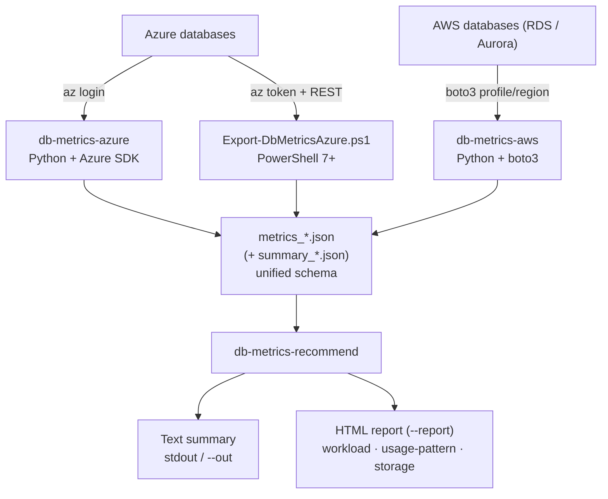

# Multi-cloud database metrics collector

A Python CLI that collects control-plane performance metrics and configuration
from **Azure** and **AWS** cloud databases using only cloud management APIs.
It **never connects to the database** and never reads row-level data — it reads
cloud platform metrics and resource configuration only.

Useful as a fast assessment/triage snapshot: SKU and storage sizing, 
non-default configuration, and every platform metric the resource exposes 
over a chosen time window.

## What it collects

1. **Resource inventory**: SKU/tier, engine version, storage (size, IOPS, 
   autogrow where applicable), HA mode/state, backup retention, network, 
   maintenance window, state — plus parameters and databases.
2. **Metric discovery**: all metrics the resource exposes, with supported 
   aggregations, units, dimensions, and available granularities.
3. **Metric time-series**: all discovered metrics over the window, each queried 
   at the finest granularity it supports (coarse-only metrics are queried at 
   their native grain), split by dimensions where present.

Output: console summary (latest / avg / max per metric) plus JSON reports 
(`metrics_<name>_<timestamp>.json` per target; `summary_<timestamp>.json` for 
multi-target runs).

## Supported services

**Azure** (6 services):
- `postgres-flexible` — Azure Database for PostgreSQL Flexible Server
- `mysql-flexible` — Azure Database for MySQL Flexible Server
- `cosmos-postgres` — Cosmos DB for PostgreSQL
- `sql-database` — Azure SQL Database
- `sql-managed-instance` — Azure SQL Managed Instance
- `single-server` — Azure Database for PostgreSQL/MySQL Single Server

**AWS** (2 services):
- `rds` — RDS DB instances
- `aurora` — Aurora DB clusters

## Workflow

Collect metrics with any of the three collectors (all emit the same JSON
schema), then run the recommender over the reports:



Typical end-to-end run (a week of Azure data → a shareable HTML report):

```bash
mkdir run && cd run
db-metrics-azure --config ../targets.json --hours 168 --interval PT1H   # writes metrics_*.json
db-metrics-recommend . --report report.html                            # sizes the fleet
```

## User guides

One guide per tool, in [`docs/guides/`](docs/guides/):

- [`db-metrics-azure`](docs/guides/db-metrics-azure.md) — Azure collector (Python + Azure SDK)
- [`db-metrics-aws`](docs/guides/db-metrics-aws.md) — AWS collector (Python + boto3)
- [`db-metrics-recommend`](docs/guides/db-metrics-recommend.md) — Lakebase sizing/cost recommender
- [PowerShell exporter](docs/guides/powershell-exporter.md) — `Export-DbMetricsAzure.ps1` (PowerShell 7+, REST)

## Requirements

- Python 3.12+
- Cloud credentials:
  - **Azure**: via the Azure CLI (`az login`), using `AzureCliCredential` pinned to the subscription's home tenant (with `DefaultAzureCredential` as fallback when no tenant is resolved). 
    Auto-detects the subscription's home tenant and pins auth to it, 
    so cross-tenant sandbox subscriptions work without extra flags.
  - **AWS**: via the standard boto3 credential chain. `--profile` and `--region`
    are optional — omit them to use `AWS_PROFILE` / `AWS_REGION` /
    `AWS_DEFAULT_REGION` or the default profile.

## Install

Clone and install with desired cloud extras:

```bash
# Azure only
pip install -e '.[azure]'

# AWS only
pip install -e '.[aws]'

# Both (recommended for development)
pip install -e '.[azure,aws]'
```

The base install (`pip install -e .`) includes no cloud SDKs — extras are required.

## Usage

Two executables (also runnable as `python -m db_metrics.cli_azure` / `python -m db_metrics.cli_aws`):
- `db-metrics-azure` — Azure resource collector
- `db-metrics-aws` — AWS resource collector

(Note: `python -m db_metrics` alone prints usage; the split CLIs prevent cross-cloud SDK pollution.)

### Azure single target

```bash
db-metrics-azure \
  --service postgres-flexible \
  --subscription <SUB_GUID_OR_NAME> \
  --resource-group <RG> \
  --server-name <SERVER_NAME> \
  [--tenant <TENANT_ID>]
```

Example (PostgreSQL Flexible Server):
```bash
db-metrics-azure \
  --service postgres-flexible \
  --subscription my-subscription \
  --resource-group my-resource-group \
  --server-name my-postgres-server \
  --hours 6 --interval PT5M
```

SQL Database (requires `--database`):
```bash
db-metrics-azure \
  --service sql-database \
  --subscription <SUB> \
  --resource-group <RG> \
  --server-name <SQL_SERVER> \
  --database <DB_NAME>
```

### Azure multi-target via config

```bash
db-metrics-azure --config targets.json
```

Config file format:
```json
{
  "defaults": {
    "cloud": "azure",
    "hours": 1,
    "interval": "PT1M"
  },
  "targets": [
    {
      "name": "prod-postgres",
      "service": "postgres-flexible",
      "subscription": "<sub-id>",
      "resource_group": "prod",
      "server_name": "prod-pg-01"
    },
    {
      "name": "prod-mysql",
      "service": "mysql-flexible",
      "subscription": "<sub-id>",
      "resource_group": "prod",
      "server_name": "prod-mysql-01",
      "hours": 24
    }
  ]
}
```

### AWS single target

`--profile` and `--region` are optional — omit them to use your ambient AWS
config (env vars or default profile). See the
[`db-metrics-aws` guide](docs/guides/db-metrics-aws.md) for details.

RDS DB instance:
```bash
db-metrics-aws \
  --service rds \
  --profile <AWS_PROFILE> \
  --region <REGION> \
  --identifier <DB_INSTANCE_ID>
```

Aurora DB cluster:
```bash
db-metrics-aws \
  --service aurora \
  --profile <AWS_PROFILE> \
  --region <REGION> \
  --cluster-identifier <CLUSTER_ID>
```

### Common options

| Flag | Default | Description |
|------|---------|-------------|
| `--hours` | `1` | Look-back window in hours |
| `--interval` | `PT1M` | Granularity (ISO-8601 duration); auto-coarsened per metric when needed |
| `--out` | auto | Output JSON path (single target only) |
| `--no-console` | off | JSON only; suppress console summary |
| `--config` | — | Multi-target JSON config file (mutually exclusive with single-target flags) |

## Output

### Single-target report
`metrics_<name>_<timestamp>.json` — complete metrics, inventory, metric definitions.

Example:
```json
{
  "collected_at": "2026-01-15T10:30:45Z",
  "name": "prod-postgres",
  "cloud": "azure",
  "service": "postgres-flexible",
  "resource_scope": "/subscriptions/.../resourceGroups/.../providers/...",
  "window": {
    "start": "2026-01-15T09:30:45Z",
    "end": "2026-01-15T10:30:45Z",
    "interval": "PT1M"
  },
  "inventory": { ... },
  "metric_definitions": [ ... ],
  "metrics": [ ... ]
}
```

### Multi-target summary
`summary_<timestamp>.json` — per-target status, metric/error counts.

### Schema parity
JSON schema is unified across Azure, AWS, and PowerShell exporter for 
cross-tool verification.

### Examples
See [`examples/`](examples/) for complete, current-schema samples:
- `example_report.json` — a single-target collector report (Azure PG Flexible Server)
- `example_report_aws_rds.json` — a second report (AWS RDS), for multi-cloud/fleet examples
- `example_summary.json` — the multi-target summary output

## Recommender

The `db_metrics.recommend` sub-package reads collector report files and
produces Lakebase CU-band sizing recommendations with estimated monthly costs.

### Install

```bash
pip install -e '.[report]'
```

The `[report]` extra adds `matplotlib` for embedded-PNG HTML reports.
The base recommender CLI works without it (plain-text output only).

### Usage

```bash
# Point at a directory of metrics_*.json files, or list files directly.
db-metrics-recommend <dir-or-files> [--report out.html]
```

Common options:

| Flag | Default | Description |
|------|---------|-------------|
| `--report PATH` | — | Write a self-contained HTML report with embedded charts |
| `--headroom FLOAT` | `0.30` | Fractional headroom added above observed peak |
| `--cu-rate FLOAT` | — | Override $/CU-hour (see note below) |
| `--region NAME` | — | Reserved for future region-aware pricing |
| `--hours-per-month FLOAT` | `730` | Hours/month for cost projection |
| `--active-fraction FLOAT` | `0.3` | Active fraction for scale-to-zero low estimate |
| `--out PATH` | — | Also write text output to this file |

### Sample output

```
────────────────────────────────────────────────────────────
  Server : prod-pg
  Cloud  : azure / postgres-flexible
  Source : Standard_D4ds_v5  [4 vCPU / 16.0 GB]
  Observed:
    CPU  avg=35.0%  peak=70.0%
    Mem  avg=9.3 GB  peak=12.5 GB
  Recommendation:
    7–9 CU (autoscaling)
  Cost   : $1,788–$2,300/mo  (placeholder rate)
============================================================
  FLEET SUMMARY
============================================================
  Total servers      : 1
  ...
============================================================
```

The complete text summary is committed at
[`examples/recommend_output.txt`](examples/recommend_output.txt). Generate the
self-contained HTML report (embedded charts, no external references) yourself:

```bash
db-metrics-recommend examples/example_report.json examples/example_report_aws_rds.json --report report.html
```

### Cost rate note

The shipped cost rate is a **PLACEHOLDER** (`$0.35/CU-hour`) and is **not
authoritative Lakebase pricing**. Override it with `--cu-rate <your-rate>` to
use the correct rate for your contract and region.

## PowerShell alternative

A PowerShell 7+ Azure exporter with the same JSON schema lives in `powershell/` —
see the [PowerShell exporter guide](docs/guides/powershell-exporter.md) (or
`powershell/README.md` for module internals).

## Development & testing

```bash
# Install with both cloud extras
pip install -e '.[azure,aws]'

# Run tests with coverage
.venv/bin/python -m pytest --cov=db_metrics
```

Unit tests cover pure transformation logic (duration parsing, granularity 
selection, time-series summarization, report rendering, and CLI orchestration) 
with mocked SDK boundaries. Live runs against real resources are integration tests.

## Module layout

```
db_metrics/
├── cli_azure.py     Azure entry point (console script: db-metrics-azure)
├── cli_aws.py       AWS entry point (console script: db-metrics-aws)
├── cli_core.py      Cloud-agnostic run engine (parser, target building, collection)
├── config.py        Multi-target config file parsing
├── models.py        Target dataclass
├── timewindow.py    ISO-8601 duration + window helpers (pure)
├── summarize.py     Summarization + granularity selection (pure)
├── report.py        Report assembly, console rendering, JSON output
├── providers/
│   ├── registry.py  Service registry: (cloud, service) -> providers
│   ├── base.py      Provider protocols
│   ├── azure/       Azure collector implementations
│   └── aws/         AWS collector implementations
└── recommend/       Lakebase sizing/cost recommender (console: db-metrics-recommend)
    ├── load.py      Report discovery/parse/validate (input boundary)
    ├── skus.py      SKU/instance-class -> (vCPU, RAM)
    ├── normalize.py Cloud metric names -> common Signals (pure)
    ├── sizing.py    CU-band heuristic (pure core)
    ├── cost.py      Monthly cost estimate (pure)
    ├── usage_profile.py  Hour-of-day usage aggregation (pure)
    ├── render_text.py    Text summary
    ├── render_html.py    Self-contained HTML report (charts)
    └── cli.py       Recommender CLI orchestration
tests/               Unit tests (repo root, sibling of db_metrics/)
docs/guides/         Per-tool user guides
powershell/          PowerShell 7+ Azure exporter (see powershell/README.md)
```
