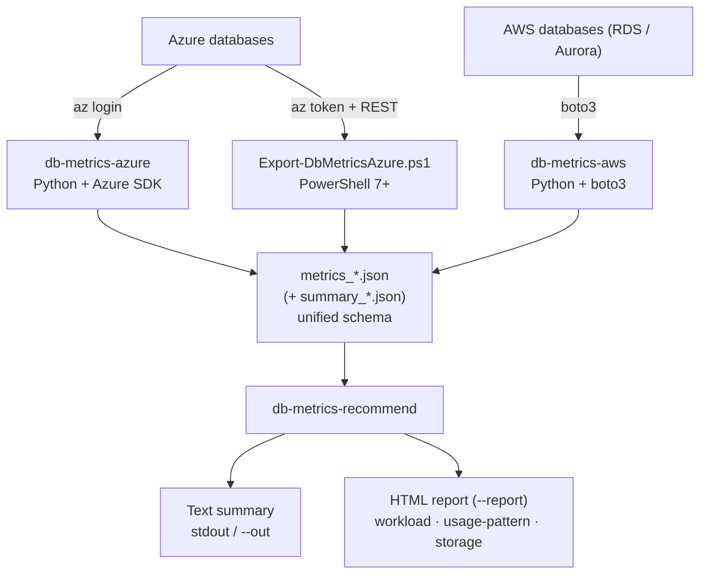

# `db-metrics-recommend` — User Guide

Turn collector reports into **Lakebase Autoscaling sizing recommendations** with
estimated monthly cost. It consumes the `metrics_*.json` files produced by
[`db-metrics-azure`](./db-metrics-azure.md), [`db-metrics-aws`](./db-metrics-aws.md),
or the [PowerShell exporter](./powershell-exporter.md), and — per source server
and fleet-wide — recommends a settable CU band (or a fixed tier) plus a cost
range.

It is cloud-agnostic, reads JSON only (no cloud SDK, no database connection), and
adds no required dependency: charts ride behind the optional `[report]` extra.

---

## Where it fits



## Prerequisites

- **Python 3.12+**
- For the HTML report, install the report extra (adds matplotlib):
  ```bash
  pip install -e '.[report]'
  ```
  The plain-text output works **without** it.
- One or more collector reports (`metrics_*.json`). No cloud credentials needed —
  this tool only reads the JSON files.

## Quick start

```bash
# A directory of reports (globs metrics_*.json), or list files directly:
db-metrics-recommend ./reports

# With a shareable HTML report:
db-metrics-recommend ./reports --report report.html

# Specific files + a saved text copy:
db-metrics-recommend metrics_prod-pg_*.json metrics_prod-rds_*.json --out summary.txt
```

## What it recommends

- **Sizing basis:** RAM is the primary denominator (~2 GB/CU); CPU is a secondary
  gate. The band is `avg → min`, `peak → max`, plus headroom (default 30%).
- **Settable CU values only.** Lakebase autoscaling accepts `0.5`, then whole
  integers up to **64 CU**, with `max − min ≤ 16 CU`. Values are snapped up to the
  nearest settable CU (so you never get an un-settable band like `6.5–8.5`).
- **Fixed-size escalation.** If the peak exceeds the 64-CU dynamic ceiling, it
  recommends the smallest settable **fixed** size (any integer **65–112 CU**,
  no autoscaling) instead of a band.
- **Cost estimate** from an editable `$/CU-hour` rate (see the cost-rate note).
- **Advisories:** connections near the limit, unknown SKU, band-span clamps, etc.

## Options

| Flag | Default | Description |
|------|---------|-------------|
| `PATH...` | — | One or more report files or directories (dirs are globbed for `metrics_*.json`) |
| `--report PATH` | — | Write a self-contained HTML report (requires the `[report]` extra) |
| `--headroom FLOAT` | `0.30` | Fractional headroom added above the observed peak (must be ≥ 0) |
| `--cu-rate FLOAT` | — | Override `$/CU-hour` (must be > 0); bypasses the flagged placeholder |
| `--hours-per-month FLOAT` | `730` | Hours/month for the cost projection (must be > 0) |
| `--active-fraction FLOAT` | `0.3` | Active fraction for the scale-to-zero low estimate (0–1) |
| `--out PATH` | — | Also write the text output to this file (in addition to stdout) |
| `--region NAME` | — | Reserved for future region-aware pricing (currently unused) |
| `--no-color` | off | Suppress ANSI colour codes (no-op for plain-text output) |

Out-of-range numeric flags are rejected with a clear message and exit code 2.

## The HTML report

`--report report.html` writes one **self-contained** file (base64-embedded PNG
charts, no external references — safe to email or open offline). Per server it
renders:

- **Workload** — avg vs peak bars for CPU %, memory, IOPS, and connection fill.
- **Daily Usage Pattern** — a line chart of CPU % (avg + peak) and memory % by
  hour-of-day, averaged across the whole collection window, so you can see *when*
  load rises and falls.
- **Storage** — used storage (GB).

Plus a fleet summary (total/fixed/unknown-SKU counts, CU totals, cost range).
Servers whose reports carry only summary data (no raw sample points) simply omit
the usage-pattern chart.

## Output & exit codes

- Text summary always prints to stdout (and to `--out` if given).
- HTML is written only when `--report` is passed and at least one report was
  usable.

| Code | Meaning |
|------|---------|
| `0` | All reports processed successfully |
| `1` | Some reports were skipped, but at least one succeeded (skips are listed in the fleet summary) |
| `2` | Usage error: bad flags, no valid reports found, or `--report` requested without matplotlib installed |

A report that fails to parse or process is **skipped** with a reason — one bad
file never aborts the run.

## Cost-rate note

The shipped rate is a **PLACEHOLDER** (`$0.35/CU-hour`) and is **not authoritative
Lakebase pricing**. Output is flagged `(placeholder rate)` whenever it's in use.
Override it for a real costing pass:

```bash
db-metrics-recommend ./reports --cu-rate <your-rate>
```

## Example

```bash
db-metrics-recommend \
  examples/example_report.json examples/example_report_aws_rds.json \
  --report report.html --out summary.txt
```

A committed text sample lives at
[`examples/recommend_output.txt`](../../examples/recommend_output.txt).

## Troubleshooting

| Symptom | Fix |
|---------|-----|
| `matplotlib is required for HTML reports` | `pip install -e '.[report]'` (or drop `--report`) |
| Exit 2, "no valid reports" | Check the path globs `metrics_*.json`, or pass files explicitly |
| A server shows "insufficient data — verify manually" | Its SKU is unknown *and* it has no absolute usage signal; verify manually or ensure the SKU is recognised |
| "placeholder rate" in output | Expected — pass `--cu-rate` with your contract rate |
